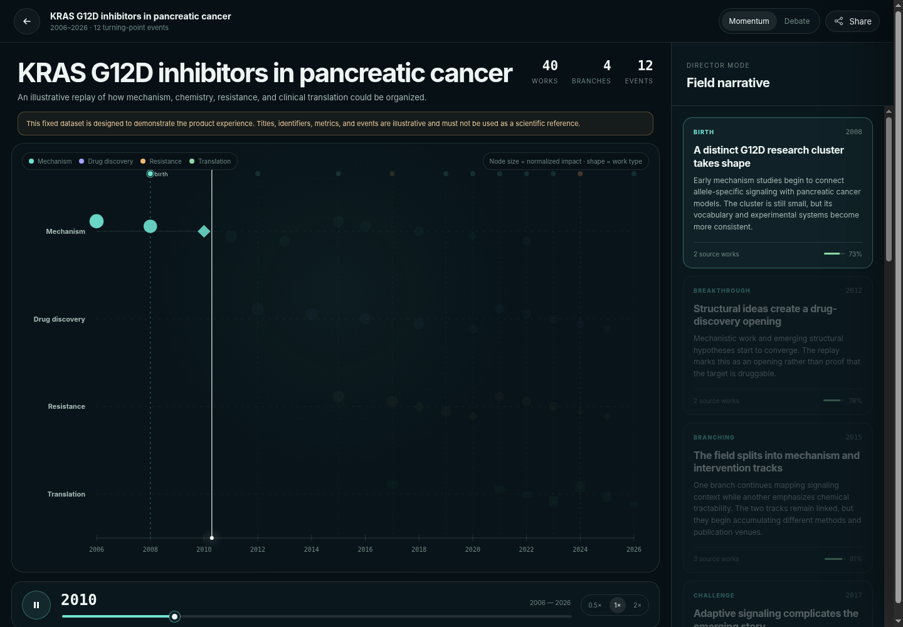

# OncoReplay

> Watch a cancer research idea evolve.



OncoReplay is an interactive research-timeline prototype that organizes papers, citation relationships, branch formation, debate signals, and clinical translation into a replayable visual narrative.

This repository delivers a polished **Phase 0 visual prototype** plus a Cloudflare-ready backend scaffold:

- responsive home, create, explore, methodology, about, and replay routes;
- a 2006–2026 KRAS G12D interaction demo with 40 illustrative nodes, 12 events, and 4 branches;
- play/pause, year scrubbing, 0.5×/1×/2×, Momentum/Debate lenses, keyboard controls, evidence drawers, deep-link-ready sharing, and reduced-motion support;
- mobile documentary-style event flow;
- Cloudflare Worker API with health, live OpenAlex query preview, built-in replay endpoint, D1 job creation, and Queue consumer scaffold;
- D1 migration matching the product plan;
- zero frontend runtime dependencies.

## Important scientific-status notice

The built-in KRAS G12D records are **illustrative interaction data**, not real citations. They are deliberately labeled throughout the UI and must not be used as a scientific reference. The custom citation-expansion, clustering, event scoring, Crossref update checking, and Workers AI narrative pipeline remain a documented scaffold rather than being misrepresented as complete.

## Local preview

Requires Node.js 20 or newer.

```bash
npm run dev
```

Open `http://localhost:4173`.

No dependency installation is required for the local static prototype. The local query preview uses a demonstration response.

## Checks and build

```bash
npm run check
npm test
npm run build
```

The production static assets are copied to `dist/`.

## Fastest Cloudflare deployment: visual demo only

```bash
npm install
npx wrangler login
npm run deploy:demo
```

This uses `wrangler.demo.jsonc`. The website and built-in replay work; live OpenAlex preview, D1, Queue, and Workers AI are not enabled.

## Full Cloudflare scaffold deployment

Follow [`SETUP_ZH.md`](./SETUP_ZH.md). In summary:

1. create an OpenAlex API key;
2. create a Cloudflare D1 database and replace its ID in `wrangler.jsonc`;
3. create the main Queue and dead-letter Queue;
4. set the `OPENALEX_API_KEY` secret;
5. apply D1 migrations;
6. build and deploy.

## Main files

```text
public/
  index.html            SPA shell
  styles.css            visual system and responsive layout
  app.js                routes, replay UI, SVG graph, interactions
  core.mjs              tested playback and filtering helpers
  data/kras-g12d.json   illustrative fixed replay
src/worker/index.js      Cloudflare Worker API and queue scaffold
migrations/0001_init.sql D1 schema
scripts/dev-server.mjs  dependency-free local server
scripts/build.mjs       static build copier
wrangler.demo.jsonc     immediate visual-demo deployment
wrangler.jsonc          full bindings scaffold
SETUP_ZH.md             external setup tutorial
```

## Product boundary

OncoReplay is a research exploration and communication tool. It is not a systematic review, a clinical decision-support system, a scientific truth arbiter, or a source of medical advice.
